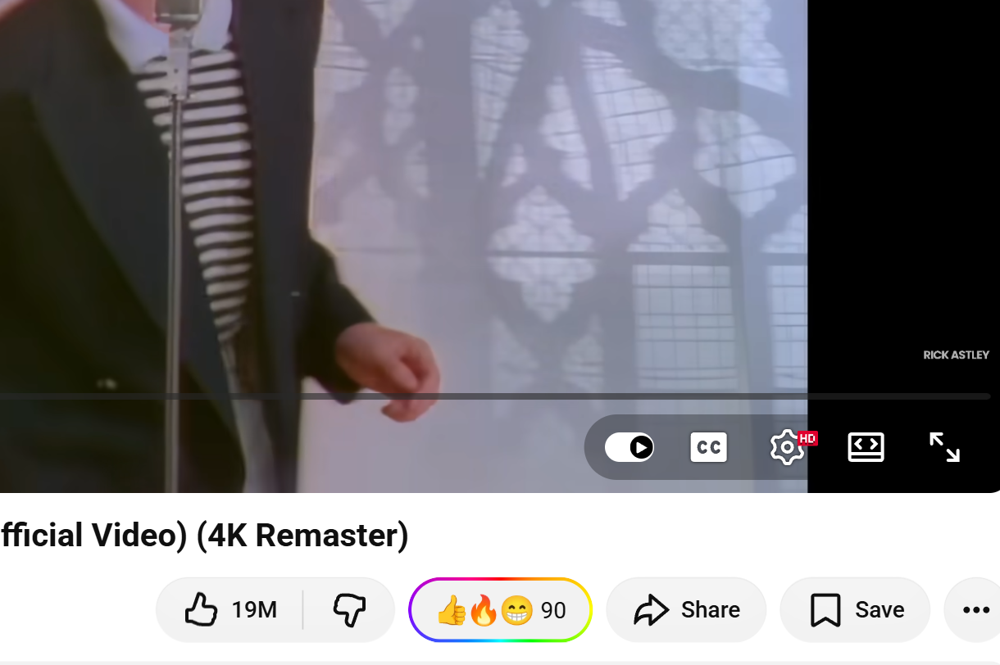
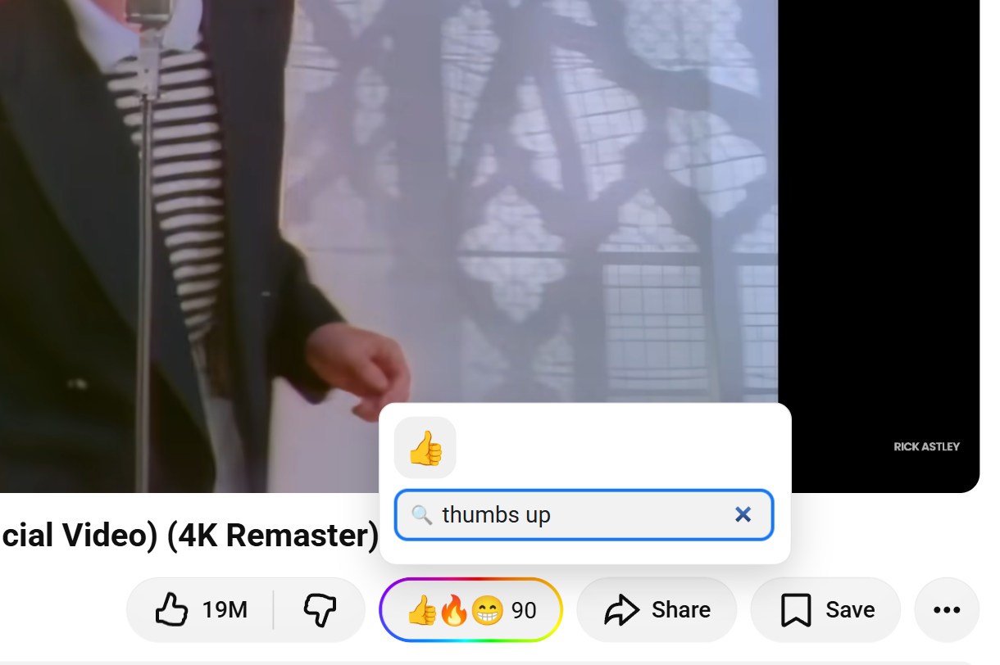
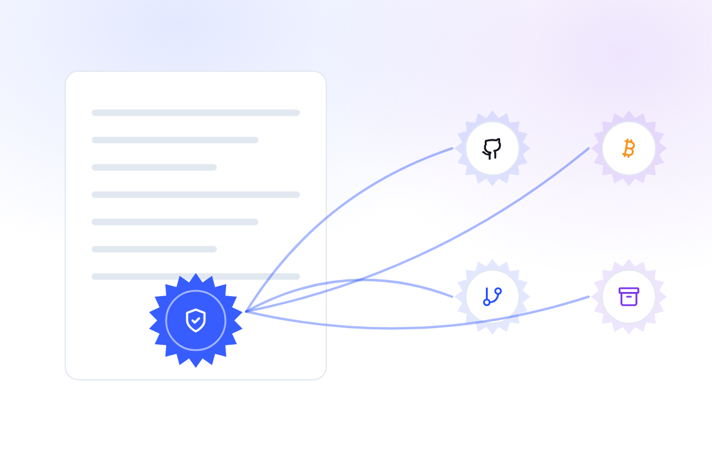
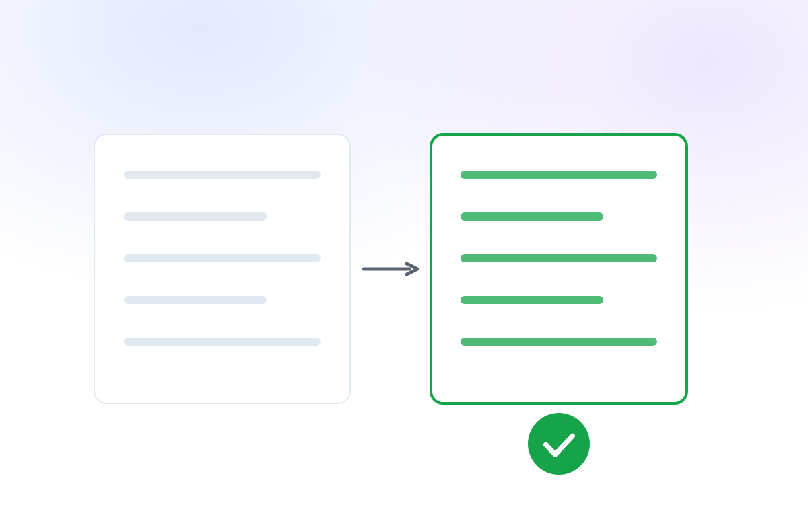
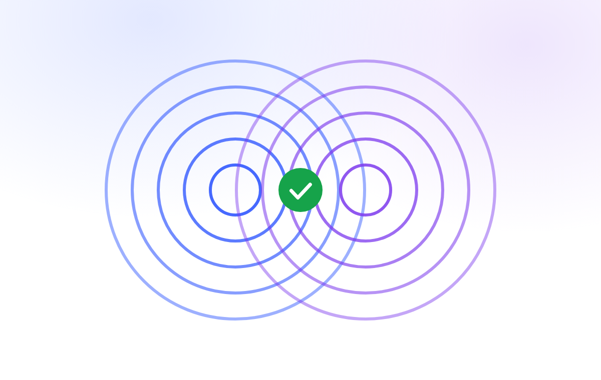

<h1 align="center">
  
</h1>

<div align="center">

A free, open source browser extension that turns Likes, Stars and upvotes into the full emoji set on GitHub, Reddit, YouTube, Amazon, Facebook, Instagram and more.

[](LICENSE) [](./package.json) [](https://github.com/khasky/emojery/issues) [](https://github.com/khasky/emojery/releases) [](https://github.com/khasky/emojery/actions/workflows/ci.yml) [](https://github.com/khasky/emojery/actions/workflows/security.yml) [](#install) [](#install) [](#install) [](https://github.com/sponsors/khasky) [](https://emojery.app/react?t=github/khasky/emojery)

[What it looks like](#what-using-emojery-looks-like) · [Features](#features) · [Supported sites](#supported-sites) · [Install](#install) · [Build from source](#build-from-source-and-development) · [Contributing](#contributing) · [Security](#security) · [Support](#support) · [Credits](#credits) · [License](#license)

</div>

## What using Emojery looks like

Most platforms hand you a short list of approved reactions: like, upvote, heart, star. Sometimes that's all you need. But plenty of the time the thing you feel isn't on the menu, and you're left picking the closest button instead of the right one. Emojery adds an independent emoji layer on top, so you can react with what you actually mean.

<table>
<tr>
<td width="50%" valign="middle">

<picture>
  <source media="(prefers-color-scheme: dark)" srcset="assets/output/captures/picker-closed-dark.png" />
  
</picture>

</td>
<td width="50%" valign="middle">

**Open a page you already use**

Watch a video, read a post, browse a product — anywhere Emojery already works.

</td>
</tr>
<tr>
<td width="50%" valign="middle">

**Find it next to the site's own buttons**

A small pill sits right beside the buttons you already know, showing the top 3 emoji and the total so far.

</td>
<td width="50%" valign="middle">

<picture>
  <source media="(prefers-color-scheme: dark)" srcset="assets/output/captures/picker-trigger-dark.png" />
  
</picture>

</td>
</tr>
<tr>
<td width="50%" valign="middle">

<picture>
  <source media="(prefers-color-scheme: dark)" srcset="assets/output/captures/picker-context-dark.png" />
  
</picture>

</td>
<td width="50%" valign="middle">

**Open the picker with one click**

One click opens the dropdown, and how everyone is reacting is right there.

</td>
</tr>
<tr>
<td width="50%" valign="middle">

**See what everyone else picked**

The top 3 come first. Tap "Show more" for the top reactions, or search the whole emoji palette.

</td>
<td width="50%" valign="middle">

<picture>
  <source media="(prefers-color-scheme: dark)" srcset="assets/output/captures/picker-context-zoom-dark.png" />
  
</picture>

</td>
</tr>
<tr>
<td width="50%" valign="middle">

<picture>
  <source media="(prefers-color-scheme: dark)" srcset="assets/output/captures/picker-react-dark.png" />
  
</picture>

</td>
<td width="50%" valign="middle">

**Pick your emoji and it counts for everyone**

Tap any emoji and the public count updates for everyone in real time.

</td>
</tr>
<tr>
<td width="50%" valign="middle">

**Find every reaction in your history**

Open Emojery from the browser toolbar and the popup lists everything you've reacted to. Click any entry to jump back to the page and change or remove your reaction. Nothing's ever locked in.

</td>
<td width="50%" valign="middle">

<picture>
  <source media="(prefers-color-scheme: dark)" srcset="assets/output/captures/hiw-history-dark.png" />
  
</picture>

</td>
</tr>
<tr>
<td width="50%" valign="middle">

<picture>
  <source media="(prefers-color-scheme: dark)" srcset="assets/output/captures/hiw-seal-dark.png" />
  
</picture>

</td>
<td width="50%" valign="middle">

**Your reaction gets sealed in public**

Every reaction joins a public record. It's regularly published to GitHub, sealed into Bitcoin and copied to independent logs and archives no single party runs.

</td>
</tr>
<tr>
<td width="50%" valign="middle">

**Anyone can check the math**

A free, open-source tool adds every reaction back up and confirms the totals match. You can find your own in the record.

</td>
<td width="50%" valign="middle">

<picture>
  <source media="(prefers-color-scheme: dark)" srcset="assets/output/captures/hiw-verify-dark.png" />
  
</picture>

</td>
</tr>
<tr>
<td width="50%" valign="middle">

<picture>
  <source media="(prefers-color-scheme: dark)" srcset="assets/output/captures/hiw-match-dark.png" />
  
</picture>

</td>
<td width="50%" valign="middle">

**Counts match**

You see the same numbers everyone else sees, and anyone can prove they add up.

</td>
</tr>
</table>

## Features

Counts you can actually believe, in a picker you'll actually enjoy.

- 🛡️ **Real people behind every count** — the count is continuously protected against manipulation. Bots and scripted padding are kept out, and anything fake that slips through is removed from the totals.
- 🔎 **Counts you can check yourself** — don't take our word for the numbers. Every reaction lands in a public, add-only record, sealed into Bitcoin, watched by independent witnesses, and recountable by a free, open-source tool anyone can run.
- 🔒 **Private by design** — change or take back reactions whenever you want. Delete your account and they are removed from the totals, leaving only the reversal needed to keep the record accurate. Your history stays on your device — no ads, profiling, or tracking.
- 🎨 **A full emoji palette** — over 600 emoji, not the site's defaults. Pick the one that actually fits, or type a word and the picker finds it, with your recently used kept one tap away, all rendered from the same art on every device.
- 🧩 **Fits every page** — takes on the page's styling and slots into the existing button row, like it always belonged there. And you decide where: switch it off per site, or swap out the native Like/Star entirely.
- 👍 **Auto-press original buttons** — your emoji can also press the site's own control. A positive pick presses Like or upvote, a negative one Dislike or downvote where the site has it. You sort which emoji count as which by dragging them between lists.
- 🌐 **Speaks your language** — emoji labels and search work in 26 languages. Type _amour_, _愛_, or _love_: all of them find ❤️.
- 🌙 **Adapts to your theme** — light or dark, the picker follows along and blends into the page instead of clashing with it.
- 🔄 **Never loses a reaction** — tap on patchy wifi and it still lands: reactions are queued and delivered when you reconnect. React in one tab and the count ticks up live in every other tab you have open.
- 📊 **Keeps your history** — browse your own reaction history in the popup: search it, narrow it down by site, emoji, or date, and export the whole thing as one file to restore on another browser.

## Supported sites

Curious what's next? Check the [roadmap](https://emojery.app/roadmap?utm_source=github&utm_medium=readme&utm_campaign=emojery&utm_content=supported_sites) for upcoming site support and planned features. Want a site added? See [how to request one](https://emojery.app/faq?utm_source=github&utm_medium=readme&utm_campaign=emojery&utm_content=supported_sites#request-site) in the FAQ.

| Site | Reacts on |
| --- | --- |
| [Facebook](https://emojery.app/facebook-reactions?utm_source=github&utm_medium=readme&utm_campaign=emojery&utm_content=supported_sites) | Posts · Photos · Reels · Videos |
| [Instagram](https://emojery.app/instagram-reactions?utm_source=github&utm_medium=readme&utm_campaign=emojery&utm_content=supported_sites) | Posts · Reels |
| [Reddit](https://emojery.app/reddit-reactions?utm_source=github&utm_medium=readme&utm_campaign=emojery&utm_content=supported_sites) | Posts |
| [GitHub](https://emojery.app/github-reactions?utm_source=github&utm_medium=readme&utm_campaign=emojery&utm_content=supported_sites) | Repos |
| [GitLab](https://emojery.app/gitlab-reactions?utm_source=github&utm_medium=readme&utm_campaign=emojery&utm_content=supported_sites) | Repos |
| [YouTube](https://emojery.app/youtube-reactions?utm_source=github&utm_medium=readme&utm_campaign=emojery&utm_content=supported_sites) | Videos · Shorts |
| [X](https://emojery.app/x-reactions?utm_source=github&utm_medium=readme&utm_campaign=emojery&utm_content=supported_sites) | Posts · Photos |
| [Threads](https://emojery.app/threads-reactions?utm_source=github&utm_medium=readme&utm_campaign=emojery&utm_content=supported_sites) | Posts |
| [Amazon](https://emojery.app/amazon-reactions?utm_source=github&utm_medium=readme&utm_campaign=emojery&utm_content=supported_sites) | Products |

[250+ more sites on the roadmap](https://emojery.app/roadmap?utm_source=github&utm_medium=readme&utm_campaign=emojery&utm_content=supported_sites).

## The questions you're right to ask

Installing an extension is an act of trust. These questions get straight answers, each backed by something you can go and check for yourself.

- ["Do I really have to install an extension?"](https://emojery.app/before-you-install?utm_source=github&utm_medium=readme&utm_campaign=emojery&utm_content=skeptic#extension)
- ["What permissions does it ask for?"](https://emojery.app/before-you-install?utm_source=github&utm_medium=readme&utm_campaign=emojery&utm_content=skeptic#permissions)
- ["Is it going to read my pages?"](https://emojery.app/before-you-install?utm_source=github&utm_medium=readme&utm_campaign=emojery&utm_content=skeptic#read-pages)
- ["Do I have to sign up?"](https://emojery.app/before-you-install?utm_source=github&utm_medium=readme&utm_campaign=emojery&utm_content=skeptic#sign-up)
- ["How do I know it isn't tracking me?"](https://emojery.app/before-you-install?utm_source=github&utm_medium=readme&utm_campaign=emojery&utm_content=skeptic#tracking)
- ["Almost nobody is on it yet. Why install?"](https://emojery.app/before-you-install?utm_source=github&utm_medium=readme&utm_campaign=emojery&utm_content=skeptic#why-now)

## Install

### From the stores

Chrome Web Store, Firefox Add-ons, and Edge Add-ons listings are **coming soon**.

### From source

Emojery is in public-unlisted beta. Until the stores go live, build it from source and load it as an unpacked add-on — see [Build from source and development](#build-from-source-and-development) below.

## Build from source and development

### Tech stack

- [WXT](https://wxt.dev/) (Manifest V3)
- [Preact](https://preactjs.com/)
- TypeScript
- [Vitest](https://vitest.dev/)

Builds for Chrome, Edge, Firefox, and Safari from one codebase.

### Prerequisites

- [Node.js](https://nodejs.org/) 24 or newer
- [pnpm](https://pnpm.io/installation) — pinned via `packageManager` in `package.json`; `corepack enable` provisions the exact version automatically
- `git`

### Clone & install

```bash
git clone https://github.com/khasky/emojery.git
cd emojery
pnpm install
```

The `postinstall` hook runs `wxt prepare` and copies the bundled emoji locales into `public/emoji-data/` — no extra step required.

### Build for your browser

Pick the target that matches your browser. `pnpm dev` runs a live HMR watcher, `pnpm build` makes an unpacked production build, and `pnpm zip` packages it for upload.

```bash
# Chrome / Brave / Arc / Opera / any Chromium fork (MV3)
pnpm dev          # dev with HMR, opens a Chrome dev profile
pnpm build        # production build → .output/chrome-mv3
pnpm zip          # package          → .output/emojery-v<version>-chrome-mv3.zip

# Microsoft Edge (MV3)
pnpm build:edge   # → .output/edge-mv3
pnpm zip:edge     # → .output/emojery-v<version>-edge-mv3.zip

# Firefox / Firefox-based browsers (Manifest V2)
pnpm dev:firefox       # dev with HMR
pnpm build:firefox     # → .output/firefox-mv2
pnpm zip:firefox       # → .output/emojery-v<version>-firefox-mv2.zip

# Safari (requires macOS + Xcode)
pnpm build:safari      # → .output/safari-mv2
pnpm zip:safari        # → .output/emojery-v<version>-safari-mv2.zip
# Then wrap .output/safari-mv2 with Xcode's "Safari Web Extension" template
```

Reproducing the Firefox package for AMO review? See [docs/amo-reviewer-build.md](docs/amo-reviewer-build.md).

### Load it unpacked

**Chromium-based browsers (Chrome, Edge, Brave, Arc, Opera, Vivaldi):**

1. Open `chrome://extensions` (or `edge://extensions`, `brave://extensions`, …).
2. Toggle **Developer mode** on (top-right).
3. Click **Load unpacked** and pick the matching `.output/<target>` folder.

**Firefox:**

1. Open `about:debugging#/runtime/this-firefox`.
2. Click **Load Temporary Add-on…** and pick any file inside `.output/firefox-mv2/` (e.g. `manifest.json`).
3. The add-on stays loaded until you restart Firefox — repeat after every restart while side-loading.

> Don't use **Install Add-on From File…** with the packaged Firefox zip: release/beta Firefox reject unsigned packages ("could not be verified"). Load the unpacked folder as a temporary add-on instead.

### Testing

Unit tests run under [Vitest](https://vitest.dev/) in a jsdom environment for extension-owned behavior: URL and ID parsing, target-key derivation, host matching, settings/storage, vote flow, shared registries, and Emojery UI components. They do **not** simulate supported-site page DOM; real placement, native-button replacement, theme/contrast, and browser integration are covered by the e2e suites.

```bash
pnpm test                          # run the unit suite once
pnpm test:watch                    # re-run on change while developing
pnpm test src/adapters/x.test.ts   # run a single file
pnpm test:browser                  # real-browser (WebKit + Firefox) tests: picker/popup UI + IndexedDB stores
pnpm test:coverage                 # unit coverage report (informational, no thresholds)
```

**End-to-end tests** ([Playwright](https://playwright.dev/)) drive the _built_ extension against the real sites. They need a Chromium download and, for the signed-in flows, test credentials, so they live apart from the fast unit loop. The suites load `.output/chrome-mv3-staging`, so build it first — without that folder every browser run fails at launch:

```bash
pnpm build:staging                 # required first: the build the suites load
pnpm test:e2e                      # full E2E suite (live sites)
pnpm test:e2e:ci                   # signed-out placement + auth-click loop (no credentials)
pnpm test:e2e:hermetic             # the browser-free project (runs on every PR; needs no build)
pnpm build:staging:firefox         # then E2E_BROWSER=firefox pnpm test:e2e — the same suite in Firefox
```

See [e2e/README.md](e2e/README.md) for E2E setup, [docs/adding-a-site.md](docs/adding-a-site.md) for how to write adapter tests, and [CONTRIBUTING.md](./CONTRIBUTING.md#pre-pr-gates) for the full pre-PR gates (`pnpm check`).

### Dev workflow & hot reload

`pnpm dev` runs a long-lived WXT watcher with HMR for the popup and auto-reload for content scripts and the background worker. See [docs/development.md](docs/development.md) for what to reload when, auto-reload prerequisites, and watcher troubleshooting.

## Contributing

Contributions are welcome — bug reports, site requests, and pull requests. See [CONTRIBUTING.md](./CONTRIBUTING.md) for where each one goes, and [docs/adding-a-site.md](docs/adding-a-site.md) for the end-to-end checklist behind the most common contribution: support for a new site. Taking part is covered by the [Code of Conduct](./CODE_OF_CONDUCT.md).

## Security

Found a vulnerability? Don't open a public issue — report it privately, see [SECURITY.md](./SECURITY.md).

## Support

If **Emojery** is useful to you, you can support development:

- [GitHub Sponsors](https://github.com/sponsors/khasky)
- [Patreon](https://www.patreon.com/khasky)
- [Ko-Fi](https://ko-fi.com/khasky)
- [Crypto](https://emojery.app/donate?utm_source=github&utm_medium=readme&utm_campaign=emojery&utm_content=support#crypto)

## Credits

- **Emoji artwork** — [Noto Emoji](https://github.com/googlefonts/noto-emoji) © Google LLC, licensed under the [SIL Open Font License 1.1](public/licenses/noto-emoji-OFL.txt). The picker and History tab bundle a WebP sprite sheet rasterized from Noto's SVG glyphs.
- **Emoji names & search keywords** — Unicode [CLDR](https://cldr.unicode.org/) via [`emojibase-data`](https://github.com/milesj/emojibase). See [docs/localization.md](docs/localization.md).

Full notices for everything shipped inside the extension package (Noto Emoji, `emojibase-data`, Preact) live in [`public/licenses/`](public/licenses/), which WXT copies into every browser build.

## License

This project is licensed under GPL-3.0-or-later. See the [LICENSE](./LICENSE) file for details.
