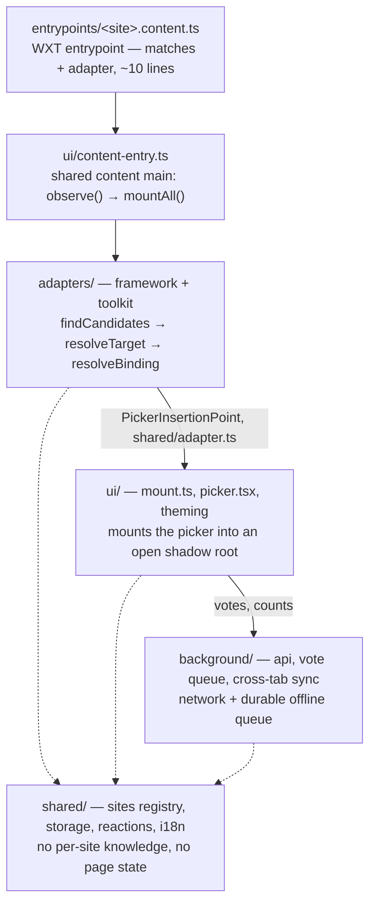
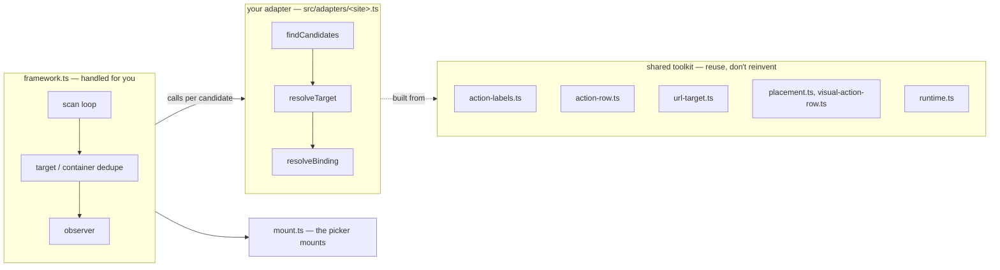

# Adding a site

The end-to-end checklist for the most common code contribution: teaching Emojery to place its picker on a new site. To *suggest* a site instead of building it, open a [site request issue](https://github.com/khasky/emojery/issues/new?template=site_request.md).

Read [CONTRIBUTING.md](../CONTRIBUTING.md) first — it carries the pre-PR gates, the rule for where a test belongs, and the commit convention that apply to every change, this one included. Set up your local build from [Build from source and development](../README.md#build-from-source-and-development).

The adapter framework (`src/adapters/framework.ts`) handles the lifecycle boilerplate (the scan loop, target/container dedupe, and the observer), so a new site mostly describes its own candidates, target, and placement.

## Architecture at a glance

Layers run top-to-bottom and dependencies point one way. A content script wires a site's adapter into the shared pipeline; the adapter produces a declarative `PickerInsertionPoint`, and the UI layer consumes it and mounts into an open shadow root. `shared/` is the foundation (site registry, storage, reactions, i18n) every layer builds on — the dashed edges. Shared here means free of per-site knowledge, and DOM typing is allowed: `adapter.ts` and `dom-query.ts` are DOM-typed on purpose, they just touch no global (`theme.ts`, which reads `document` / `matchMedia`, is the one exception).



Adding a site is almost entirely the top 2 boxes — a registry row, an adapter, and a content entrypoint. The one thing below them a new site still needs is its brand glyph for the popup's per-site list (`src/ui/brand-icons.ts`, step 3); `background/` and the rest of `ui/` and `shared/` stay untouched.

## The files a new site touches

The full scope before the prose: steps 1–2 decide what to build and step 10 runs the gates; every file in between is guarded, so a skipped row fails a command rather than shipping a gap. Each step below is a section of this document.

| Step | You edit | Skipping it fails |
| --- | --- | --- |
| [3](#3-register-the-site-single-source-of-truth) | `src/shared/sites.ts` — the registry row | — (the source everything below derives from) |
| [3](#3-register-the-site-single-source-of-truth) | `src/ui/brand-icons.ts` — the brand glyph | `pnpm compile` (total `Record<SupportedSite, ...>`) |
| [4](#4-write-the-adapter-with-definesiteadapter) | `src/adapters/<site>.ts` — the adapter | — (the work itself) |
| [5](#5-the-canonical-id-is-a-wire-contract) | `src/adapters/target-contract.ts` — a `URL_DERIVABLE_SITES` entry + a `deriveTargetFromUrl` case (URL-derivable sites only) | `pnpm test` (`lockstep.test.ts`) |
| [5](#5-the-canonical-id-is-a-wire-contract) | a row in `src/adapters/__data__/target-vectors.json` (or a `notUrlDerivable` entry) | `pnpm test` (`lockstep.test.ts` coverage guard) |
| [6](#6-add-the-content-entrypoint) | `src/entrypoints/<site>.content.ts` | `pnpm test` (`content-matches.test.ts`) |
| [7](#7-add-the-supported-sites-row-to-the-readme) | the Supported-sites table row in `README.md` | `pnpm test` (row-count guard) |
| [8](#8-adapter-unit-tests-required) | `src/adapters/<site>.test.ts` | — (no gate catches a missing adapter test; it is a review requirement) |
| [9](#9-add-an-e2e-scenario) | `e2e/supported-sites.ts` + `E2E_URL_*` in `.env.e2e.example` | `pnpm test` (`e2e-site-coverage.test.ts`) |
| [9](#9-add-an-e2e-scenario) | the DEEP/SMOKE tier + URLs in `e2e/site-auth/scenarios.ts` | `pnpm test` (`e2e-site-coverage.test.ts`) |
| [11](#11-manual-smoke-on-the-live-site--against-the-staging-api) | — (the staging round-trip) | nothing — manual; note the result in the PR |

## Design invariants

The load-bearing rules that keep the codebase small and safe to extend. Each is a cross-cutting decision, not a local edit — know them before you change one:

- **The registry is the single source of truth.** One row in `SUPPORTED_SITES` (`src/shared/sites.ts`) derives every per-site list: the `SupportedSite` union, labels, toggles, and match patterns (enumerated in step 3), plus the manifest `host_permissions` and `web_accessible_resources` through `wxt.config.ts`; each entrypoint's content-script `matches` literal stays hand-written, pinned to the registry by `src/shared/content-matches.test.ts` (step 6). The 2 per-site tables it can't derive are each caught, by a different gate. `SITE_BRAND` (`src/ui/brand-icons.ts`) is a total `Record<SupportedSite, ...>`, so a new registry row fails `pnpm compile` until the glyph is filled in (step 3). The e2e tables are plain lists over that same union, `SUPPORTED_SITE_SCENARIOS` (`e2e/supported-sites.ts`) and the DEEP/SMOKE tiers (`e2e/site-auth/scenarios.ts`), so a compiler can't see a gap in them; the coverage guard in `src/shared/e2e-site-coverage.test.ts` fails `pnpm test` until the new site has a scenario, a fixture URL, and a tier (step 9). Nothing else downstream is edited by hand.
- **The adapter framework is a thin skeleton.** It owns only the shared infrastructure — the scan loop, target/container dedupe, and the observer. All site knowledge lives in the `findCandidates -> resolveTarget -> resolveBinding` callbacks; `resolveBinding` returns a `Binding` (a `PickerInsertionPoint` minus its `target`), so the framework assembles the point but never reinterprets a site's placement (step 4).
- **The adapter → UI contract is declarative.** An adapter's only output is a `PickerInsertionPoint` (`src/shared/adapter.ts`) — `anchor` / `position` / `wrapper` / `fallback` / `triggerLayout` / `nativeElement`. `mount.ts` carries no per-site branching (no `if (site === ...)`): everything a site needs at mount time travels through that struct, which is why a new site never touches `mount.ts`.

  **One deliberate exception**, and the only per-site branch in non-test `src/ui/`: Facebook's 7-reaction hover flyout. Its open/press protocol (hover-intent reset, pointer sequence, the picker-open prewarm) is live-verified browser choreography, not placement, so it lives in `src/ui/native-trigger.ts` behind the `reactionMenu.kind: "facebook"` discriminator while the adapter still owns the DOM half (`findMenu`). A second site with a hover flyout is the trigger to push that protocol behind an adapter-supplied callback — until then, one implementation beats a speculative abstraction.
- **The background is a validating trust boundary.** Content scripts, popup, and background talk over discriminated-union messages (`src/shared/messages.ts`), validated at the boundary in `src/background/message-guard.ts`: https-only URLs, byte-bounded reactions, the site allowlist, and `sender.id` / `sender.tab` segmentation. A new message type is validated there or it doesn't cross.
- **Votes are a durable, offline-first queue.** Reactions persist to IndexedDB and drain through a single-drain guard with per-owner checks at enqueue and drain (safe across account switches), plus optimistic history rollback and cross-tab broadcast (`src/background/api.ts`, `src/background/vote-sync.ts`). A reaction taken offline lands on reconnect.
- **`targetId` is a permanent wire contract.** Every stored reaction lives under the id shape the adapter emits, and the public verifier re-computes counts from the log — the derivation has to stay stable or counts split. `src/adapters/lockstep.test.ts` pins the URL→id shape so it can't drift silently (step 5).

Work top-to-bottom; the drift tests fail loudly if you skip a registry step.

## 1. Check the site qualifies

Before writing code, check the site against the constraints the extension is built on. For a borderline case, open a [site request issue](https://github.com/khasky/emojery/issues/new?template=site_request.md) and settle it there before investing in an adapter.

- **Targets must be publicly addressable.** A reaction can only be recorded for content an anonymous, logged-out visitor can view (that's what `isPrivatePage` enforces per page — step 4). A platform whose content sits entirely behind a login wall is not a fit, regardless of placement quality.
- **One item, one stable identity.** Every reactable item needs a canonical id that most sites derive deterministically from the URL and that stays identical across every URL variant: desktop and mobile hosts, share links, tracking params. No stable public id → counts can't merge (step 5).
- **A native action surface.** The picker mounts beside the site's own Like/Star/Share controls; a site with no per-item action row has nowhere to put it.
- **Mixed public/private content is fine**, but then the adapter **must** ship an `isPrivatePage` gate (step 4).

A mostly login-gated site also can't run in the unauthenticated e2e suite (step 9), which is part of how every site is continuously verified — one more reason to raise it in an issue first.

## 2. Pick the site id, label, hosts

Choose a lowercase `site` id (e.g. `"mastodon"`), a brand `label` (e.g. `"Mastodon"`), and the exact hostnames the adapter runs on.

## 3. Register the site (single source of truth)

Add one row (`site`, `label`, `hosts`, `homeUrl`, optional `urlHosts` / `hostRegex` / `resolveHomeUrl`) to `SUPPORTED_SITES` in `src/shared/sites.ts`. `resolveHomeUrl` overrides the popup's per-site home link when one global `homeUrl` isn't enough (see Amazon's regional storefronts).

That row automatically updates everything derived from it: the `SupportedSite` union, `ALL_SITES`, `SITE_LABELS`, `DEFAULT_SITE_TOGGLES`, `ALL_SITE_MATCH_PATTERNS`, the popup toggle, the manifest host permissions, and storage defaults.

Then add the site's **brand glyph** to `SITE_BRAND` in `src/ui/brand-icons.ts` — the mark shown beside the toggle in the popup's per-site list. It's a total `Record<SupportedSite, ...>`, so until you add it `pnpm compile` fails with `Property '<site>' is missing ... but required in type 'Record<...>'`. Take the 24×24 `path` from the site's [simple-icons](https://simpleicons.org/) glyph (CC0) and its brand `color`, or `"currentColor"` for a mark that is inherently monochrome.

## 4. Write the adapter with `defineSiteAdapter`

Create `src/adapters/<site>.ts`:

```ts
import { defineSiteAdapter } from "./framework";

export default defineSiteAdapter({
  site: "<site>",
  // `matches` defaults to `detectSupportedSite(host) === "<site>"` (the registry
  // run-host contract) — omit it unless your site needs a bespoke host rule.
  findCandidates: ({ root }) => /* DOM elements to bind from */,
  resolveTarget: (candidate, ctx) => /* TargetRef | null */,
  resolveBinding: (candidate, ctx) => /* Omit<PickerInsertionPoint,"target"> | null */,
  observer: { /* ScanObserverProfile, e.g. navKey: "pathname" */ },
});
```

**How the adapter, framework, and toolkit relate:**



A typical social site is mostly configuration: a label registry + an action-row config + a URL parser + an anchor chain, with no hand-written DOM walks. The shared toolkit:

- **Action labels:** `action-labels.ts` — `defineLabelRegistry({ like: {...}, comment: {...} }, opts)` matches a site's localized action labels by aria/text stems, an X-style `data-icon`, or a Threads-style SVG `iconPathPrefix`. Gives `classify` / `matchAction` / `findActionControl(row, kind)` / `presentKinds(root)`. Compose the `stems` from `STEM` (the ready-made multi-locale union; per-entry coverage varies, see `action-labels.ts`) or, to narrow to the locales a site actually ships, from the per-locale parts in `STEM_PARTS` via `stem(...)` — so the label vocabulary lives in ONE place. See `x.ts`, `instagram.ts`, `threads.ts`, `facebook-post-row.ts`.
- **Comment-row reject:** `action-row.ts` — `rejectCommentRow(markers, replyKind)(row, registry)` drops a post's comment row (Like + Reply, no post markers) so the picker never lands on a comment. Finding the action row itself is **per-site bespoke** — each social adapter keeps its own visual-first / structural row walk. There is intentionally no shared `findActionRow`: e.g. Threads keys off a Reply+Repost signature with an optional Like, which doesn't fit a shared shape.
- **URL → target:** `url-target.ts` — `urlTargetResolver({ parse, toTarget })` returns a `resolveTarget` that parses `location.href` and maps the ref it yields to a `TargetRef`. Only for **location-only** sites (see `github.ts`, `youtube.ts`); it reads nothing but the page URL. The shared scaffolding one step down is `parseSiteHref(href, site, parse)`, which every site's own parser uses: null-check, resolve against `location`, host-gate, swallow a malformed URL. A site whose target needs more than the page URL (a container-scoped permalink scan, a DOM-id fallback, a quoted-tweet/focused-status gate) keeps its own `resolveTarget` and only shares `parse`. Keep `parse` exported under its `extract...Ref` name so each adapter's URL/ID extraction stays a stable, directly testable entry point.
- **Sibling anchor:** `placement.ts` — `findSiblingAction(row, [slotAction(row, selectors), ...])` walks a prioritized list of neighboring actions and returns the first match's direct-child slot in the row. Best fit when the mount anchor is a neighboring action the site marks with a stable selector, with the label registry's `findActionControl` as the fallback (see `x.ts`: before View, else Bookmark — by selector first, then by action stem for logged-out X, where the Bookmark testid is absent). A site that anchors structurally or geometrically rather than by neighbor, with a selector/child-index walk (`youtube.ts`) or the next visible slot (`instagram.ts`), resolves the anchor itself.
- **Host validation:** `shared/sites.ts` — `urlHostBelongsToSite(host, site)` is the one host check a URL parser needs (no per-site host list). It reads the descriptor's optional `urlHosts` — the **parse-hosts**, a superset of the manifest `hosts` for bare/mobile domains that show up in DOM links the extension doesn't itself run on (e.g. Facebook `facebook.com`). Distinct from `adapter.matches` (the narrower run-host contract): `matches("facebook.com")` is false while the parser still resolves a `facebook.com` permalink.
- Selector-list queries: `shared/dom-query.ts` — `queryAll`, `queryFirst`, `queryAllDeep` (open shadow roots). In `shared/` rather than the adapters because `ui/` needs them too, and importing them upward would point a dependency the wrong way.
- Other DOM helpers: `runtime.ts` — `closestAny`, `directChildSlot`, `compactElements`, `orderModalFirst`, `precedes`, `textOf`/`collapseWhitespace`, `safeMatches`/`matchesAny`.
- Placement strategies: `placement.ts` — `findFirstAnchor` (the single page-level anchor from a prioritized fallback chain, as in `github.ts`/`gitlab.ts`/`amazon.ts`/`youtube.ts`) and `findSiblingAction`/`slotAction`. A strategy used by exactly one site lives in that adapter instead, next to its caller (`closestWithin` in `gitlab.ts`, `findListItemWithin`/`isListItemWithin` in `github.ts`, `resolveSegmentedGroup` in `youtube.ts`). A row that needs the host wrapped to hold the row's layout declares that as the adapter's own `wrapper` on the `PickerInsertionPoint` (see `x.ts`'s grow-slot wrapper), not through a shared helper. Path parsing: `url-target.ts` `pathSegments`.
- Visual geometry: `visual-action-row.ts` — `findVisualActionSlot`, `isRenderableInPageLayout`, `hasRenderableBox`, `isStructuralRoot`.

Pipeline rules the framework enforces for you: target dedupe by `targetId`, optional container dedupe (`dedupeContainer`), dropping candidates with no target/binding, and the observer. Use `ctx.memo(candidate, () => ...)` to compute an expensive per-candidate lookup once and share it across the `dedupeContainer` / `resolveTarget` / `resolveBinding` callbacks (it caches `null` results too).

The spec also has an optional page-level gate. `isPrivatePage`: when the page's content isn't viewable by an anonymous public visitor (a private repo / project / account), it returns true and the scan yields no points — a site with private content **must** ship it (see `page-visibility.ts` and its use in `github.ts` / `gitlab.ts`).

If a placement edge case shows up for a second site, move it into `placement.ts` and add a unit test; don't copy it.

### Matching action labels across languages

Sites label the same button differently per language — "Like" / "Нравится" / "Подобається" / "Gefällt mir". Instead of one giant per-site regex, the vocabulary is split in `action-labels.ts`: `STEM_PARTS` holds one word-family per locale, each in exactly one place.

```ts
STEM_PARTS.like = { en: /\b(?:un)?like(?:d)?\b/iu, ru: /нрав/iu, ua: /подоба|вподоб/iu, de: /gefällt/iu };
```

`stem(...)` OR-joins the parts you pass into a single regex. An adapter composes only the locales its site actually ships:

```ts
import { STEM, STEM_PARTS, stem } from "./action-labels";

// The ready-made union for this action (like: EN/RU/UA/DE):
like: STEM.like,
// Narrowed on purpose — X ships Repost/Retweet in EN/RU/UA but never "Reshare"
// (this is x.ts's real composition; keep the locales your site ships):
repost: stem(STEM_PARTS.repost.repost, STEM_PARTS.repost.retweet, STEM_PARTS.repost.repostRu, STEM_PARTS.repost.retweetUk, STEM_PARTS.repost.poshyryt),
```

Omitting a locale is deliberate, not an oversight: Instagram and Facebook skip German because Facebook's own German UI ("gefällt", "teilen") would over-match. `STEM` is per-action, and not every action carries every locale — `comment` and `send` have no German, `bookmark` no Ukrainian, and `repost` has no `STEM` entry at all because its 2 consumers (`x.ts`, `instagram.ts`) each compose a narrower subset. Read the entry you are about to use in `action-labels.ts` rather than assuming it spans all 4. Reach for `STEM` when you want its whole union for that action; drop to `STEM_PARTS` + `stem(...)` only to narrow it.

### When a custom `observer` is justified

Most sites pass a `ScanObserverProfile` (debounce, `attributeFilter`, `navKey`, nav/trigger events, `linkPrimeSelectors`). For an irreducibly bespoke watch, reach for a **plugin** (`observer-plugins.ts`) composed into the standard observer via `plugins: [...]` — *not* a full custom `observe`:

- open or dynamically-attached **shadow DOM** that needs per-root observation → `shadowRootDiscovery` (see Reddit);
- **hover / focus priming** to resolve lazy, hydrated-on-interaction data → `lazyHoverPriming` (see Facebook);
- **URL-only navigation** the standard machinery can't see — a `pushState` SPA route change with no `popstate` and no observed attribute change, where the new surface can settle without a childList mutation (Instagram: opening/closing a post, returning to the feed, advancing the reel viewer) → `urlChangeRescan` (see Instagram).

A full custom `observe` function is rarely needed now; prefer a plugin so the standard mutation/nav/link-prime machinery still applies. Either way, keep using the binding pipeline (`findCandidates` / `resolveTarget` / `resolveBinding`) — only the watch is bespoke.

## 5. The canonical id is a wire contract

The `targetId` shape your adapter emits, together with the URL canonicalization behind it, is a **permanent wire contract**, even though it looks like an implementation detail. Every stored reaction lives under the id shape you pick now, and every URL variant of the same item has to derive that same id (see the header of `src/adapters/lockstep.test.ts`). Changing the shape or the canonicalization later silently splits existing counts, so it would need a coordinated backend release — treat it as a breaking change and design it before writing placement code:

- **Enumerate every URL variant first** — desktop and mobile hosts, share/short links, tracking query params, trailing slashes, locale prefixes. Every variant of the same item must derive the **same** id, and page state (login, session, theme) must never leak into it.
- **Derive from the stable resource key, not the page URL** — the post/video/product id the site itself treats as permanent; strip everything volatile.
- **Emit one canonical URL** next to the id, and keep the derivation **idempotent** — the canonical URL must re-derive to the same id.

If the id derives purely from the URL (most sites), teach the pure derivation your site, then pin it:

1. In `src/adapters/target-contract.ts` add the site to `URL_DERIVABLE_SITES` and a `case` to `deriveTargetFromUrl` that calls your adapter's own exported `extract...Ref` + `<site>TargetFromRef` — the same 2 functions the shipped scan runs, so this can't drift from what a real page emits.
2. In `src/adapters/__data__/target-vectors.json` add a `urlDerivable` row pinning both properties on a canonical vector, plus `variantUrls` for the other live surfaces of the same item and `noTargetUrls` for the shapes that must derive nothing (a profile, a subpage, an off-site host wearing the same path).

That file is the vectors themselves, kept as data so each end of the wire contract pins its derivation against the same rows — a table living inside a test only one implementation can run is how the two drift apart. `src/adapters/lockstep.test.ts` replays it on the client side, and its coverage guard fails for any registered site that neither has a row nor is listed under `notUrlDerivable` — so `pnpm test` won't let you forget the choice. A site whose id needs page state beyond the URL (GitLab, Facebook) skips step 1 and goes in `notUrlDerivable` instead.

## 6. Add the content entrypoint

Create `src/entrypoints/<site>.content.ts` with `matches` equal to `https://<host>/*` for each declared host. The literal can't be computed from the registry (WXT extracts it statically to generate the manifest), but it can't drift either: `src/shared/content-matches.test.ts` asserts every entrypoint's `matches` equals `matchPatternsForSite("<site>")`, so a host added in one place but not the other fails `pnpm test`.

## 7. Add the Supported-sites row to the README

Add a row to the Supported sites table in `README.md`. The drift suite (`src/shared/content-matches.test.ts`) checks the table has exactly one row per registered site, so a forgotten row fails `pnpm test`.

## 8. Adapter unit tests (required)

Add `src/adapters/<site>.test.ts`. Unit-test the adapter's **pure, extension-owned logic** with plain strings — never by building the site's DOM and calling `scan()`, per [where a test belongs](../CONTRIBUTING.md#where-a-test-belongs). Model it on `src/adapters/x.test.ts`:

```ts
import { describe, expect, it } from "vitest";
import siteAdapter, { extractSiteRef } from "./<site>";
import { expectMatchesRegistryHosts } from "./test-fixtures";

describe("<site> adapter", () => {
  it("matches its registry hosts only", () => {
    // Asserts every registry run-host matches (and generic non-hosts don't).
    expectMatchesRegistryHosts(siteAdapter, "<site>");
    // Site-specific negatives: e.g. a parse-host that must NOT be a run host.
    expect(siteAdapter.matches("m.<host>")).toBe(false);
  });

  it("extracts the canonical target ref from real URL shapes", () => {
    expect(extractSiteRef("https://<host>/post/123")).toEqual({
      /* handle/id/url/... */
    });
    expect(extractSiteRef("https://<host>/")).toBeNull();
  });
});
```

Cover the logic the adapter actually owns: host `matches()` (one `expectMatchesRegistryHosts` call from `test-fixtures.ts` plus site-specific negatives), URL/ID **ref extraction** (keep `parse` exported under its `extract...Ref` name so the URL/ID extraction stays directly testable), target-key derivation, and the baked `DEFAULT_*` selector arrays being the single source of truth (no remote override). For **shared** placement/row logic that more than one site reuses, unit-test it against **generic, site-agnostic** elements in the style of the `framework.test.ts` sentinels, never a copy of a real site's markup.

**Placement on the real page belongs to e2e** — where the picker mounts, native-control replacement, theme/contrast, localized-label placement, and dedupe across real posts are all verified by the e2e suites (`e2e/site-injection.spec.ts`, `e2e/theme-contrast.spec.ts`, `e2e/site-auth/`), driving a real browser.

## 9. Add an e2e scenario

The unauthenticated e2e suite (`e2e/site-injection.spec.ts`) is what keeps proving the adapter against the live site after the PR merges — a new site ships with at least one scenario:

1. Pick stable public URLs (long-lived posts/videos/products unlikely to be deleted) and add them to `.env.e2e.example` as `E2E_URL_<SITE>` / `E2E_URL_<SITE>_<VARIANT>` entries.
2. Add one scenario per URL to `SUPPORTED_SITE_SCENARIOS` in **`e2e/supported-sites.ts`** (data only — the spec that drives them stays in `site-injection.spec.ts`), modeled on an existing entry: `site`, a human-readable `label`, `urlKey: "<SITE>"` (the `E2E_URL_` suffix, resolved at run time), `mountKeyPattern` (a regex the mounted `data-khasky-emojery-mounted` key must match, e.g. `"^x:\\d+$"`), `nativeSelectors` (the site's own action controls the trigger must sit near), and `containerSelectors` (the per-item container). Add `scrollSteps` / `settleMs` when the target only appears after scrolling or the page is slow to settle.
3. Put the site in `DEEP_SITES` or `SMOKE_SITES` in `e2e/site-auth/scenarios.ts` and give it feed + content URLs there (deep = the feed-heavy, bot-sensitive platforms).

`src/shared/e2e-site-coverage.test.ts` fails `pnpm test` for a registered site with no scenario, and for one missing from both site-auth tiers — so a site can't ship with zero live coverage.

Run it against your staging build: `pnpm run build:staging`, then `pnpm exec playwright test -c e2e/playwright.config.ts site-injection.spec.ts --grep "<label>"`. See `e2e/README.md` for setup and the anti-bot caveat — on bot-walled sites a `skip` is expected and is not a failure.

## 10. Run the gates (must be green)

The same gates every PR runs — the full list and what each one catches is in [CONTRIBUTING.md](../CONTRIBUTING.md#pre-pr-gates):

```bash
pnpm test    # the fast inner loop while you work: vitest run (drift guards included)
pnpm check   # the gate itself, in one command
```

## 11. Manual smoke on the live site — against the staging API

A new-site PR is judged on 2 things you can verify yourself: the **adapter's client-side behavior**, meaning where the picker mounts and how it survives the page lifecycle, and the reaction *round-trip*. New sites work against the public **staging API** (`https://api-staging.emojery.app`) before they go live in production — exactly the environment for testing a new-site build end-to-end.

Build against staging and load it unpacked:

```bash
pnpm build:staging   # emits .output/chrome-mv3-staging, targeting the staging API
```

Sign in with a real, permanent email address and open the live site. Staging is a separate environment: its accounts and reactions are isolated from production, and **staging data is reset periodically** — so don't be surprised when your test reactions vanish; that's the reset, not a bug.

Verify:

- the picker appears next to the native action, correctly placed;
- signed in, clicking an emoji paints the selected state, animates, and sends the vote with no error in the page or service-worker console;
- the reaction **persists**: reload the page — it's still set, the count incremented, the entry shows in popup History; unreact removes it;
- with "Hide original buttons" on, the layout doesn't break and the picker takes the native control's place (no jump/duplicate);
- SPA navigation / infinite scroll don't create duplicate pickers;
- signed-out: clicking opens the auth tab and doesn't break the page's own click handlers.

Note the round-trip result in your PR.

## What happens after the merge

The maintainers take the site live after the merge — nothing for you to do. But it works from what the PR carries, so make sure the PR includes:

- the registry row — hosts, plus `urlHosts` when the parse-hosts differ (step 3);
- `extract...Ref` exported, with exhaustive URL vectors in the unit test (steps 5, 8) — the vectors that pin the canonical id shape;
- the lockstep row for a URL-derivable site (step 5);
- the staging round-trip result (step 11).

Until the site is live on production, keep verifying against staging.

There is deliberately **no** scaffold/CLI; this checklist is the contract.
